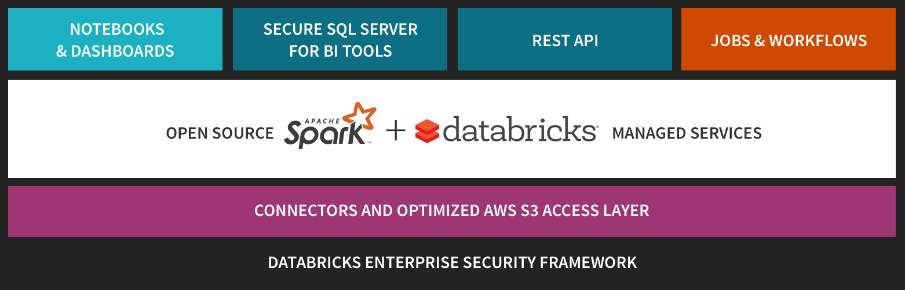
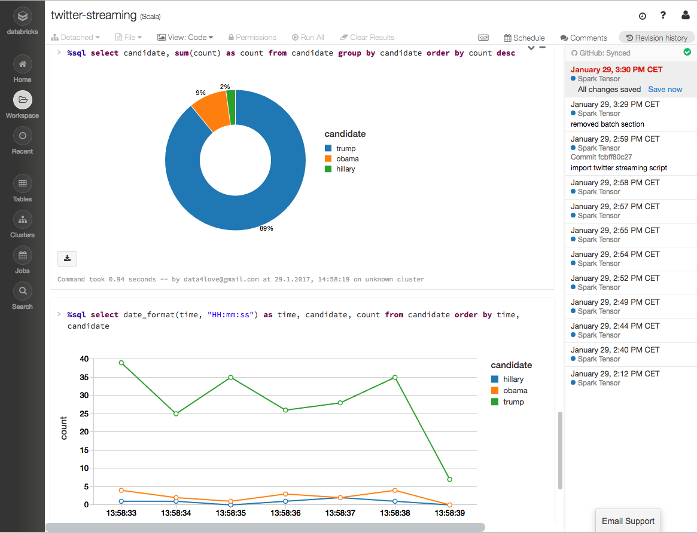

name: title
# Databricks Platform

### Manuel Walser, January 2017

.footnote[Slide and Notebooks: https://github.com/higgser/databricks]

???
* create table
* when are dbfs files on machine deleted? how much space?
* Experience from Spark Summit Europe 2016
* Created with [remark.js](https://github.com/gnab/remark) and [Markdown to slides](https://github.com/partageit/markdown-to-slides)
* Compile with: `markdown-to-slides -s Remark.css Databricks.md -o Databricks.html`

- upload to github-pages
- update screenshot
- publish notebook?
- install tensorflow libs
- run examples tensorflow
  - simple titanic/digit example
  - simple countword mit java job in ide, run job in databricks
  - twitter streaming example

---
name:overview
## Databricks Overview
* Managed Platform for running Apache Spark
  https://databricks.com/product/databricks
* Making big data access easy (and accessible for everyone)
  https://databricks.com/try-databricks
* Built-in Documentation and Examples
* Pricing and Editions
  https://databricks.com/product/pricing



???
* Simplifies cluster management and maintaince tasks
* Point&Click Platform for DS and DA
* REST API to automate data workflows
* Role-based access control and other intelligent optimizations
* **Start Cluster now**

---
name: demo
## Features and Demo
.pull-left[
Community
* Mini-Cluster
* Notebooks
* Documentation
* Dashboards
* Libraries
* Jobs Mgmt
* User Mgmt

Professional
* REST API
* IDE Integration
* GitHub
* Single Sign-On
]

.pull-right[]

???
* Workspace: File-Explorer
* Notebooks: Files with Cells to execute commands
* Dashboards: Styled and filtered notebook output (Cluster must be running)
* Libraries: Files with additional functionality
* Tables: Database Tables
* Cluster: Groups of computers, Spark Web UI
  Pricing starts with 'r3.xlarge' for (2x 0.33 USD/h On-Demand)
* Jobs: Schedule Notebooks/Jars, Notebook Workflows
* Apps: Third Party Integration, e.g. Tableau
* Menu-Bar, Search-Button

---
name: notebookFeatures
## Notebook Features
.table.table-condensed.table-striped.table-hover[
| Databricks | Zeppelin | Jupiter
--- | --- | --- | ---
Notebooks | .label.label-success[Yes] | .label.label-success[Yes] | .label.label-success[Yes]
Autocompletion | .label.label-warning[Basic] | .label.label-warning[Basic] | .label.label-warning[Basic]
Languages | .label.label-success[Spark] | .label.label-success[Polyglot] | .label.label-success[Polyglot]
Playground | .label.label-success[Online] | .label.label-warning[Docker] | .label.label-success[No Spark]
Desktop Mode | .label.label-danger[No] | .label.label-success[Yes] | .label.label-success[Yes]
Data Visualizations | .label.label-success[Nice] | .label.label-warning[Basic] | .label.label-danger[No]
Git support | .label.label-success[Prof.] | .label.label-warning[File] | .label.label-warning[File]
Dashboards | .label.label-success[Yes] | .label.label-warning[iFrame] | .label.label-warning[plotly]
]

.footnote[Languages: Scala, Python, R, (Spark)SQL, Markdown, Shell  
Alternatives: [Beaker](http://beakernotebook.com/), [Spark-Notebook](http://spark-notebook.io)
]

???
* Create new Databricks and AWS Account (same AWS region, takes about 60 minutes)
* Databricks Account is linked to Amazon Account, You are responsible for the AWS costs of clusters you create (Deploy to AWS using Cross Account Role or Access Key)
* Start a Cluster, Show Link to Spark UI
* Create a notebook, Output Markdown, SparkSession spark.version
* Show Revision History, Git Integration, and Export Options
* Open and Run simple Example, Show Execution Graph
* Create Dashboard, Add Graphs
  https://dbc-a0e28f3c-9620.cloud.databricks.com/#notebook/258/dashboard/280/present


---
name: cloudFeatures
## Cloud Features
.table.table-condensed.table-striped.table-hover[
| Databricks | AWS/Zeppelin | AWS/JupiterHub
--- | --- | ---
Schedule Jobs | .label.label-success[Yes] | .label.label-danger[No] | .label.label-danger[No]
Collaboration | .label.label-success[Yes] | .label.label-warning[Git] | .label.label-warning[Git]
Security/Permissions | .label.label-success[Easy] | .label.label-danger[No] | .label.label-warning[Basic]
REST API | .label.label-success[Yes] | .label.label-warning[Livy] | .label.label-warning[Basic]
]

---
name: links
## Links
Databricks
- [Community Login](https://community.cloud.databricks.com), [Pricing](https://databricks.com/product/pricing)
- [Documentation](https://docs.databricks.com/), [REST API](https://docs.cloud.databricks.com/docs/latest/databricks_guide/01%20Databricks%20Overview/10%20REST%20API.html), [TensorFlow](https://docs.databricks.com/applications/deep-learning/tensorflow.html)

Other
- [AWS Pricing](https://aws.amazon.com/de/ec2/pricing/on-demand)
- [Jupyter Playground](https://try.jupyter.org/)

Videos
- [Spark Summit SF 2016](https://spark-summit.org/2016/schedule/)
- [Spark Summit Europe 2016](https://spark-summit.org/eu-2016/schedule)

---
name: questions
## Discussion, Q&A

---
## Missing Features/Drawbacks/Bugs/...
- Search and replace (requested), Code refactoring
- Select, move, delete multiple cells
- Auto-refresh plots with streaming data
- Update Dashboard when widget changes
- Deploy trained mode as WebService

---
### Zeppelin Docker
Ubuntu Docker image (Ubuntu, Zeppelin 0.6.2, Spark 2.1.0, Scala 2.11)
```bash
docker run -d -p 8080:8080 -p 7077:7077 -p 4040:4040 epahomov/docker-zeppelin
```

### Jupiter Docker
After installation with `pip3 install jupyter`
```bash
jupyter notebook
```
